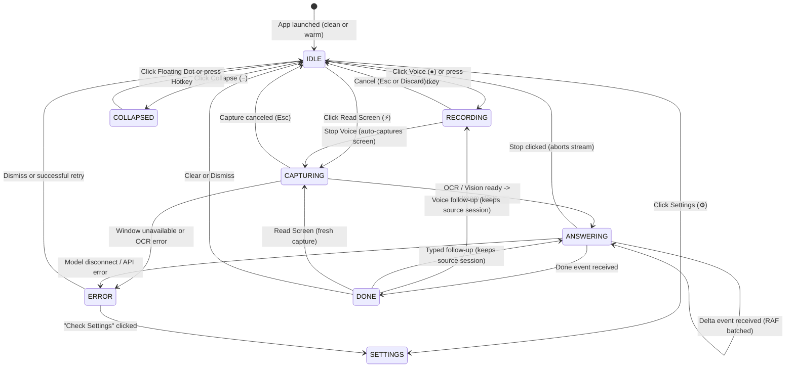

# Float Dot — Minimal UI State Transitions (M00 Contract)

Updated: 9 October 2026 · Windows v1 Minimal Overlay Specification

This document defines the formal state transitions of the Float Dot desktop assistant. All UI states are testable against synthetic fixtures defined in `tests/fixtures/contract-fixtures.json` without requiring live AI models or external API keys.

---

## 1. Minimal Experience States

| State | Visual Container | Key Visible Elements | Primary Actions |
|---|---|---|---|
| **IDLE** | Compact toolbar (300–360 × 44 DIP) | Brand pill, active model indicator, Read screen button, Voice mic button, quick prompt bar, overflow menu (⋯) | Read screen (`⚡`), Voice (`●`), Type + `Enter`, Settings (`⚙`), Collapse (`−`) |
| **RECORDING** | Compact toolbar (working mode) | Pulsing red record indicator, live waveform, recording timer, clear "⏹ Stop" button | Stop (`⏹`), Cancel (`Esc`) |
| **CAPTURING** | Compact toolbar (working mode) | "Reading screen…", spinner, target window/screen label | Cancel (`Esc`) |
| **ANSWERING** | Compact toolbar + attached Answer card (380–440 × 160–320 DIP) | Streaming Markdown content, session turn badge, Stop button (`⏹`) | Stop generation (`⏹`), Cancel (`Esc`) |
| **DONE** (Completion) | Compact toolbar + attached Answer card | Complete structured Markdown, session turn badge, Copy button (`📋`), Export (`💾`), Follow-up input | Copy (`📋`), Follow-up (`💬`), Export (`💾`), Clear (`✕`), New capture (`⚡`) |
| **SETTINGS** | Overlay Drawer (380–440 DIP) | Provider selector (5 choices), Model ID, API key, Opacity slider, Shortcuts, Appearance (Dark/Light/Opaque) | Save, Test connection, Remove key, Close |
| **ERROR** | Inline Banner inside card or toolbar | Concise user-facing error message, single prominent recovery button | Recovery action (e.g. "Retry", "Check Settings", "Start Ollama"), Dismiss |

---

## 2. State Transition Matrix

---

## 3. Session & Memory Rules

1. **Session Scope:** Sessions are strictly keyed by `sourceId` (e.g., `screen:default` or `window:0x1024`).
2. **Context Freshness:**
   - When a fresh capture is triggered on the same window, `context.id` refreshes to reference the latest screen pixels, while multi-turn conversational history is retained (up to `maxHistory = 8` messages / 4 turns).
   - When the user selects a *different* window or switches modes, conversational history resets to 0.
3. **Cancellation Isolation:**
   - Triggering Cancel aborts the active `AbortController` in both main process and coordinator.
   - Any late-arriving SSE deltas carrying a canceled `requestId` are discarded immediately.
4. **Immutable Request Snapshot:**
   - Every `AnswerRequest` takes a snapshot of provider, model, baseURL, reasoning flag, and sendImage flag at initiation time. Changes in the Settings drawer do not mutate in-flight requests.
